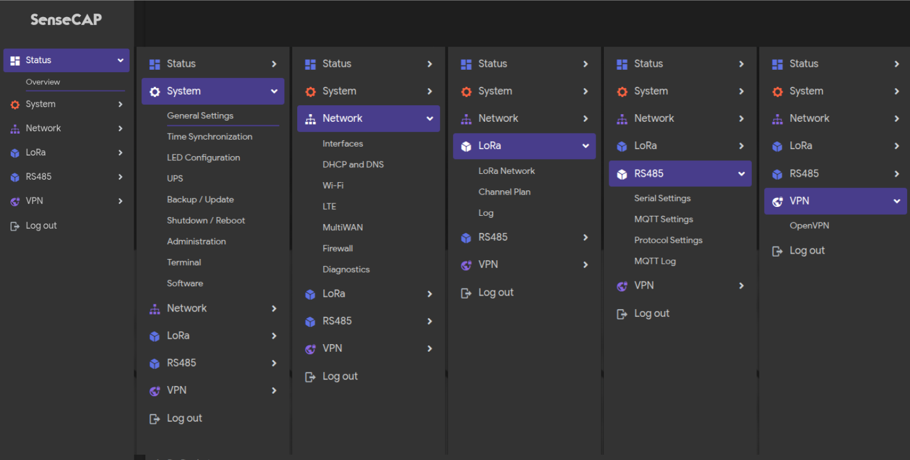

# Recomputer Gateway - LoRaWAN Gateway Firmware

> OpenWrt-based LoRaWAN gateway firmware for Seeed Studio's Recomputer Gateway device

[](https://github.com/seeed-station/recomputer-gateway/actions)

## Overview

Recomputer Gateway is a full-featured LoRaWAN gateway firmware built on OpenWrt 24.10 and deployed via LXC containers. The firmware integrates multiple LoRaWAN protocol stacks including **ChirpStack**, **Semtech packet_forwarder**, and **Basic Station**, along with 4G/LTE mobile network access, MQTT services, and serial communication (UART/RS485) capabilities.

## Features

- **Base System**: OpenWrt 24.10 (ARMv8/aarch64)
- **LoRaWAN Support**:
  - ChirpStack Concentrator
  - Semtech Packet Forwarder
  - Basic Station
- **Networking**:
  - 4G/LTE dial-up networking
  - Multi-WAN support (load balancing/failover)
  - Routing configuration management
- **Peripherals**:
  - RS485 serial configuration
  - UPS power management
- **Web Management**:
  - LuCI interface (SenseCap theme)
  - Web terminal
  - LoRa status monitoring
  - LTE status display
  - OTA upgrade support

## Screenshots

### System Status Overview



System overview page displaying LoRa status, network connections, and packet statistics.

## Device Information

| Item | Value |
|------|-------|
| Target Platform | ARMv8 (aarch64_generic) |
| OpenWrt Version | openwrt-24.10 |
| Container | LXC |
| Default User | root (no password) |

## Directory Structure

```
recomputer-gateway/
├── .config                    # OpenWrt build configuration
├── .github/
│   └── workflows/
│       └── build.yml          # GitHub Actions build workflow
├── feeds.conf.default         # Feeds configuration
├── feeds/
│   ├── chirpstack/            # ChirpStack related packages
│   ├── lorawan-gateway/       # LoRaWAN Gateway backend services
│   └── luci-lorawan-gateway/  # LuCI Web interface extensions
│       ├── luci-app-gateway/      # Main gateway configuration app
│       ├── luci-app-lora/         # LoRa status display
│       ├── luci-app-lte/          # LTE configuration
│       ├── luci-app-ups/          # UPS power management
│       ├── luci-app-rs485/        # RS485 configuration
│       ├── luci-app-terminal/     # Web terminal
│       ├── luci-app-ota/          # OTA upgrade
│       ├── luci-app-multiwan/     # Multi WAN configuration
│       ├── luci-app-routing/      # Routing configuration
│       └── luci-theme-sensecap/   # SenseCap theme
├── openwrt/                   # OpenWrt source (downloaded during build)
└── README.md                  # This document
```

## Building

### System Requirements

- **OS**: Ubuntu/Debian Linux
- **Disk Space**: > 50GB recommended
- **Memory**: > 8GB recommended

### Install Dependencies

```bash
sudo apt-get update
sudo apt-get install build-essential clang flex bison g++ gawk \
    gcc-multilib g++-multilib gettext git libncurses5-dev \
    libssl-dev rsync unzip zlib1g-dev file wget
```

### Build Steps

#### 1. Initialize Submodules

```bash
git submodule update --init --recursive
```

#### 2. Clone OpenWrt Source

```bash
git clone https://github.com/openwrt/openwrt.git -b openwrt-24.10
cd openwrt
rm -r feeds.conf.default
cp ../feeds.conf.default feeds.conf.default
```

#### 3. Update and Install Feeds

```bash
./scripts/feeds update -a
./scripts/feeds install -a
```

#### 4. Apply Configuration

```bash
cp ../.config .config
make defconfig
```

#### 5. (Optional) Disable Rust LLVM CI Download for Faster Build

```bash
sed -i 's/--set=llvm.download-ci-llvm=true/--set=llvm.download-ci-llvm=false/' \
    feeds/packages/lang/rust/Makefile
```

#### 6. Build

```bash
unset CI GITHUB_ACTIONS CONTINUOUS_INTEGRATION
make -j$(nproc)
```

#### 7. Get Build Output

After completion, the firmware is located at:
```
openwrt/bin/targets/armsr/armv8/openwrt-armsr-armv8-generic-rootfs.tar.gz
```

### Customization

To customize the firmware (e.g., add packages, modify kernel settings), run `menuconfig` in the `openwrt` directory:

```bash
cd openwrt
make menuconfig
```

## Deployment

The firmware is deployed to the device via LXC container:

### 1. Stop Existing Container

```bash
sudo lxc-stop -n SenseCAP
```

### 2. Clean and Create New rootfs

```bash
sudo rm -rf /var/lib/lxc/SenseCAP/rootfs
sudo mkdir -p /var/lib/lxc/SenseCAP/rootfs
```

### 3. Extract New Firmware

```bash
sudo tar -xzf /path/to/openwrt-armsr-armv8-generic-rootfs.tar.gz \
    -C /var/lib/lxc/SenseCAP/rootfs
```

### 4. Start Container

```bash
sudo lxc-start -n SenseCAP
```

### 5. Enter Container for Debugging

```bash
sudo lxc-attach -n SenseCAP
```

## Function Modules

### LoRaWAN Gateway

- **Config File**: `/etc/config/lora_pkt_fwd`
- **Service**: `lorawan_gateway`
- **UI**: LuCI Gateway app

### ChirpStack Concentrator

- **Target**: seeed-gateway
- **Service**: `chirpstack-concentratord`

### LTE/WWAN Support

- **Config**: `/etc/config/network`
- **Firewall**: LTE and WWAN networks have firewall rules added

### Multi-WAN Support

- Supports multiple WAN configurations including LTE and Ethernet
- Load balancing and failover capabilities

## Development

### SSH to LXC Container

From host machine:
```bash
sudo lxc-attach -n SenseCAP
```

### View Logs

```bash
# LoRa packet forwarder logs
logread | grep lora

# System logs
logread
```

### Web Interface

Access `http://[IP_ADDRESS]/cgi-bin/luci` for:
- **Status Overview**: LoRa status, network connections, packet statistics
- **Services**: LoRa, network and other configurations

## Feeds Description

| Feed | Description |
|------|-------------|
| packages | OpenWrt official packages (openwrt-24.10) |
| luci | OpenWrt LuCI Web interface (openwrt-24.10) |
| routing | Routing related packages (openwrt-24.10) |
| chirpstack | Local link - ChirpStack integration |
| lorawan_gateway | Local link - LoRaWAN gateway services |
| luci_lorawan_gateway | Local link - Gateway LuCI interface |

## FAQ

### Build Fails

**Problem**: Errors during compilation
**Solution**:
- Check disk space (recommend > 50GB)
- Ensure submodules are updated: `git submodule update --init --recursive`
- Rust compilation is slow, disable CI LLVM download to speed up

### Cannot Access After Deployment

**Problem**: Cannot access web interface after container starts
**Solution**:
- Check LXC container status: `sudo lxc-ls -f`
- View container logs: `sudo lxc-info -n SenseCAP`
- Verify network configuration is correct

### LoRa Data Not Displaying

**Problem**: No data on LoRa status page
**Solution**:
- Check concentrator service status
- View logs: `logread | grep -i lora`
- Verify gateway configuration is correct

## Related Links

- [OpenWrt](https://openwrt.org/)
- [ChirpStack](https://www.chirpstack.io/)
- [LuCI](https://github.com/openwrt/luci)
- [Seeed Studio](https://www.seeedstudio.com/)

## License

This project follows the OpenWrt project license requirements.

## Contributing

Issues and Pull Requests are welcome!