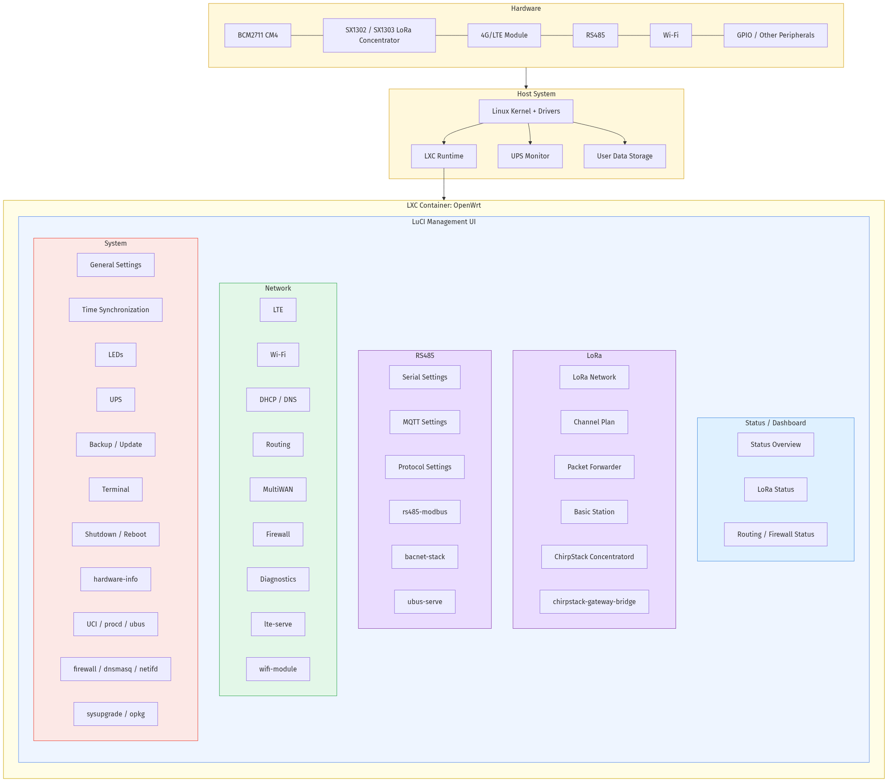
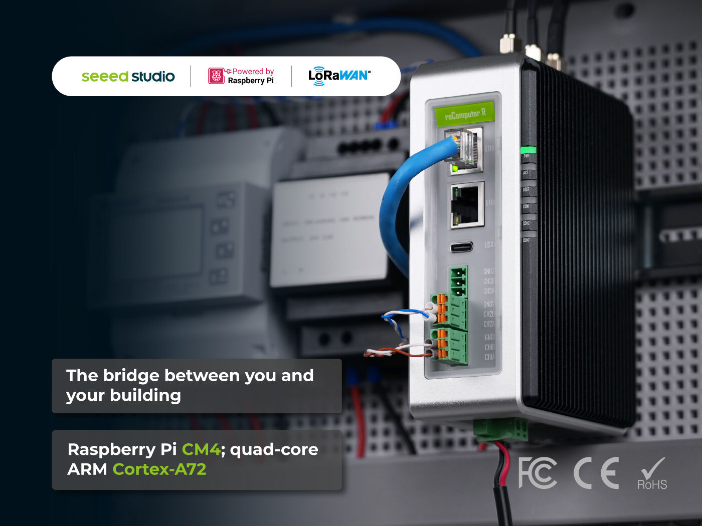
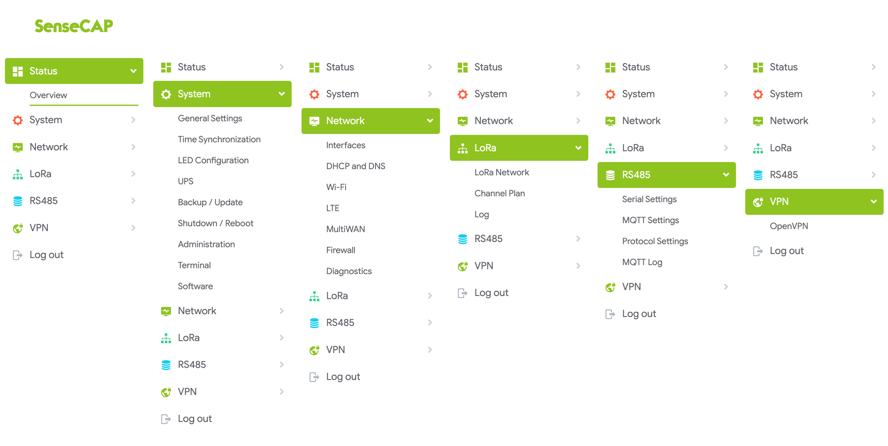
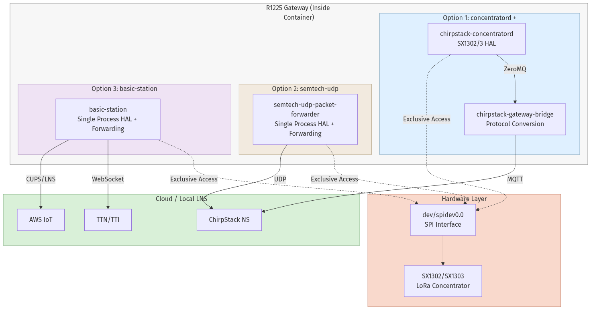
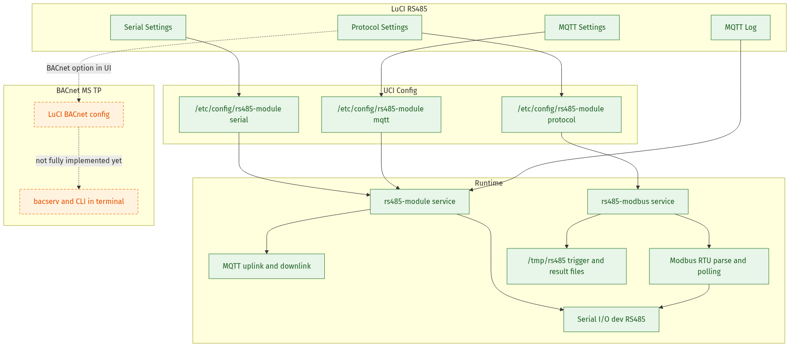

# SenseCAP Gateway OS

SenseCAP Gateway OS は、産業用屋内シナリオ向けに設計されたマルチプロトコル IoT ゲートウェイオペレーティングシステムです。OpenWrt をベースに、LoRaWAN ゲートウェイ、産業バスデータ収集、ビル管理レポートの 3 つの主要機能を備えた標準化されたソフトウェア基盤を提供します。

本システムは、Debian ホストと単一の LXC コンテナ（OpenWrt）を組み合わせた革新的な軽量アーキテクチャを採用しています。すべてのビジネスロジックは単一の OpenWrt コンテナ内にカプセル化されて実行され、ホストシステムはハードウェア抽象化とコンテナ管理のみを担当します。この設計により、最適なリソース利用、強力なセキュリティ分離、運用の柔軟性を実現しています。

[![license][license-badge]][license]
[![prs][prs-badge]][prs]
[![issues][issues-badge]][issues]
[![release][release-badge]][release]
[![contact][contact-badge]][contact]

[English](README.md) | [中文](README_zh-CN.md) | [日本語](README_ja.md) | [Français](README_fr.md) | [Português](README_pt.md) | [Español](README_es.md)

## 目次

- [特徴](#特徴)
- [推奨ハードウェア](#推奨ハードウェア)
- [機能とロードマップ](#機能とロードマップ)
- [ディレクトリ構造](#ディレクトリ構造)
- [はじめに](#はじめに)
  - [システム要件](#システム要件)
  - [依存パッケージのインストール](#依存パッケージのインストール)
  - [ビルド手順](#ビルド手順)
  - [カスタマイズ](#カスタマイズ)
- [デプロイメント](#デプロイメント)
- [機能モジュール](#機能モジュール)
  - [LoRaWAN ゲートウェイ](#lorawan-ゲートウェイ)
  - [ChirpStack コンセントレータ](#chirpstack-コンセントレータ)
  - [LTE/WWAN サポート](#ltewwan-サポート)
  - [マルチ WAN サポート](#マルチ-wan-サポート)
- [フィードの説明](#フィードの説明)
- [FAQ](#faq)
- [関連リンク](#関連リンク)
- [ライセンス](#ライセンス)
- [コントリビューション](#コントリビューション)

## 特徴

- **最小限のホストシステム**: Debian ホストはカーネル、LXC ツールチェーン、ハードウェアドライバ、UPS 監視のみを保持し、アプリケーションレベルのサービスは実行しません。
- **シングルコンテナアーキテクチャ**: すべてのサービス（LoRaWAN サービス、ネットワーキング、ペリフェラル管理、Web サービス）は、単一の LXC コンテナ内でネイティブ OpenWrt パッケージとして実行されます。
- **シンプルな運用**: シングルコンテナ設計により、構成管理、アップグレードのロールバック、トラブルシューティングが簡素化され、運用の複雑さが軽減されます。



> **注意:** 上の図は、LXC コンテナ（OpenWrt）内で実行されるソフトウェアコンポーネントのみを示しています。ホストシステム（Debian）レイヤー（Linux カーネル、ハードウェアドライバ、LXC ランタイム、UPS モニター、ユーザーデータストレージを含む）は上部に別途表示されており、コンテナイメージの一部ではありません。

## 推奨ハードウェア

<p align="center">
  
</p>

| **デバイス** | **リンク** |
| --- | --- |
| reComputer R1225 LoRaWAN ゲートウェイ & 産業用コントローラ (US915-4G) | [購入する](https://www.seeedstudio.com/reComputer-R1225-LoRaWAN-Gateway-Industrial-Controller-US915-4G-p-6721.html) |
| reComputer R1225 LoRaWAN ゲートウェイ & 産業用コントローラ (US915) | [購入する](https://www.seeedstudio.com/reComputer-R1225-LoRaWAN-Gateway-Industrial-Controller-US915-p-6722.html) |
| reComputer R1225 LoRaWAN ゲートウェイ & 産業用コントローラ (EU868-4G) | [購入する](https://www.seeedstudio.com/reComputer-R1225-LoRaWAN-Gateway-Industrial-Controller-EU868-4G-p-6719.html) |
| reComputer R1225 LoRaWAN ゲートウェイ & 産業用コントローラ (EU868) | [購入する](https://www.seeedstudio.com/reComputer-R1225-LoRaWAN-Gateway-Industrial-Controller-EU868-p-6720.html) |

reComputer R1225 Wiki: <https://wiki.seeedstudio.com/r1225_introduction/>

SenseCAP Gateway OS は R1225 専用システムであるだけでなく、移植可能なゲートウェイソフトウェアソリューションでもあります。異なるハードウェアプラットフォームに適応でき、パートナーがシステムを迅速にカスタマイズおよび拡張することが可能です。

## 機能とロードマップ




🔜 **今後の予定:**

- BACnet プロトコルの Web 設定サポートを追加
- シリアルポートと Modbus の Web 設定ロジックを最適化
- 4G ネットワークウォッチドッグサービスを追加

## ディレクトリ構造

```
recomputer-gateway/
├── .config                    # OpenWrt ビルド設定
├── .github/
│   └── workflows/
│       └── build.yml          # GitHub Actions ビルドワークフロー
├── feeds.conf.default         # フィード設定
├── feeds/
│   ├── chirpstack/            # ChirpStack 関連パッケージ
│   ├── lorawan-gateway/       # LoRaWAN ゲートウェイバックエンドサービス
│   └── luci-lorawan-gateway/  # LuCI Web インターフェース拡張
│       ├── luci-app-gateway/      # メインゲートウェイ設定アプリ
│       ├── luci-app-lora/         # LoRa ステータス表示
│       ├── luci-app-lte/          # LTE 設定
│       ├── luci-app-ups/          # UPS 電源管理
│       ├── luci-app-rs485/        # RS485 設定
│       ├── luci-app-terminal/     # Web ターミナル
│       ├── luci-app-ota/          # OTA アップグレード
│       ├── luci-app-multiwan/     # マルチ WAN 設定
│       ├── luci-app-routing/      # ルーティング設定
│       └── luci-theme-sensecap/   # SenseCap テーマ
├── openwrt/                   # OpenWrt ソース（ビルド時にダウンロード）
└── README.md                  # このドキュメント
```

## はじめに

### システム要件

- **OS**: Ubuntu/Debian Linux
- **ディスク容量**: 50GB 以上推奨
- **メモリ**: 8GB 以上推奨

### 依存パッケージのインストール

```bash
sudo apt-get update
sudo apt-get install build-essential clang flex bison g++ gawk \
  gcc-multilib g++-multilib gettext git libncurses5-dev \
  libssl-dev rsync unzip zlib1g-dev file wget
```

### ビルド手順

#### 1. サブモジュールの初期化

```bash
git submodule update --init --recursive
```

#### 2. OpenWrt ソースのクローン

```bash
git clone https://github.com/openwrt/openwrt.git -b openwrt-24.10
cd openwrt
rm -r feeds.conf.default
cp ../feeds.conf.default feeds.conf.default
```

#### 3. フィードの更新とインストール

```bash
./scripts/feeds update -a
./scripts/feeds install -a
```

#### 4. 設定の適用

```bash
cp ../.config .config
make defconfig
```

#### 5. (オプション) Rust LLVM CI ダウンロードを無効にしてビルドを高速化

```bash
sed -i 's/--set=llvm.download-ci-llvm=true/--set=llvm.download-ci-llvm=false/' \
  feeds/packages/lang/rust/Makefile
```

#### 6. ビルド

```bash
unset CI GITHUB_ACTIONS CONTINUOUS_INTEGRATION
make -j$(nproc)
```

#### 7. ビルド出力の取得

完了後、ファームウェアは以下の場所にあります:

```
openwrt/bin/targets/armsr/armv8/openwrt-armsr-armv8-generic-rootfs.tar.gz
```

### カスタマイズ

ファームウェアをカスタマイズするには（パッケージの追加、カーネル設定の変更など）、openwrt ディレクトリで menuconfig を実行します:

```bash
cd openwrt
make menuconfig
```

## デプロイメント

ファームウェアは LXC コンテナを介してデバイスにデプロイされます:

### 1. 既存のコンテナを停止

```bash
sudo lxc-stop -n SenseCAP
```

### 2. rootfs のクリーンと新規作成

```bash
sudo rm -rf /var/lib/lxc/SenseCAP/rootfs
sudo mkdir -p /var/lib/lxc/SenseCAP/rootfs
```

### 3. 新しいファームウェアの展開

```bash
sudo tar -xzf /path/to/openwrt-armsr-armv8-generic-rootfs.tar.gz \
  -C /var/lib/lxc/SenseCAP/rootfs
```

### 4. コンテナの起動

```bash
sudo lxc-start -n SenseCAP
```

### 5. LXC コンテナへの SSH

```bash
sudo lxc-attach -n SenseCAP
```

### 6. ログの表示

```bash
# LoRa パケットフォワーダのログ
logread | grep lora

# システムログ
logread
```

### 7. Web インターフェース

`http://[IP_ADDRESS]/cgi-bin/luci` にアクセス:

- **ステータス概要**: LoRa ステータス、ネットワーク接続、パケット統計
- **サービス**: LoRa、ネットワークおよびその他の設定

## 機能モジュール

### LoRaWAN ゲートウェイ

- **設定ファイル**: `/etc/config/lora_pkt_fwd`
- **サービス**: `lorawan_gateway`
- **UI**: LuCI Gateway アプリ



### ChirpStack コンセントレータ

- **ターゲット**: `seeed-gateway`
- **サービス**: `chirpstack-concentratord`

### LTE/WWAN サポート

- **設定**: `/etc/config/network`
- **ファイアウォール**: LTE および WWAN ネットワークにファイアウォールルールを追加

### マルチ WAN サポート

LTE とイーサネットを含む複数の WAN 設定をサポートし、ロードバランシングとフェイルオーバー機能を備えています。

#### ネットワークインターフェースアーキテクチャ

reComputer R1225 には **2 つの物理イーサネットポート**（ETH0 と ETH1）が搭載されています。これらのポートは、ホスト-コンテナアーキテクチャに基づいて異なる役割を果たします:

| ポート | 役割 | 説明 |
|------|------|------|
| **ETH0** | コンテナ (LXC) インターフェース | このインターフェースは、ホストの LXC ネットワーク設定を通じて **ハードウェアから LXC コンテナに直接マッピング（パススルー）** されます。OpenWrt コンテナはこのインターフェースを完全に制御し、標準的な WAN または LAN ポートとして管理します。すべてのアプリケーションレベルのトラフィック（LoRaWAN アップリンク、MQTT、Web UI アクセスなど）はこのポートを通じて流れます。 |
| **ETH1** | ホスト (Debian) インターフェース | このインターフェースは **Debian ホストシステムによって管理** されます。ホストへの SSH アクセス、コンテナ管理操作、ファームウェア更新、UPS 監視通信などのホストレベルの管理タスクに使用されます。コンテナネットワークスタックからは分離されています。 |

この分離により、コンテナネットワークが誤設定されたり到達不能になった場合でも、ホスト管理インターフェースはリカバリとメンテナンスのためにアクセス可能な状態を維持します。

### RS485 / Modbus

- **設定ファイル**: `/etc/config/rs485-module`（シリアル、MQTT、プロトコル）
- **サービス**: `rs485-module`、`rs485-modbus`
- **UI**: LuCI RS485 アプリ（シリアル設定、プロトコル設定、MQTT 設定、MQTT ログ）

RS485 モジュールは、**Modbus RTU** と **BACnet MS/TP** を含む産業用プロトコルをサポートしています:

- **Modbus RTU**: RS485 シリアルインターフェースを介した Modbus レジスタのポーリングと解析、MQTT アップリンク/ダウンリンクを通じたデータ転送。
- **BACnet MS/TP**: ビルオートメーション統合のための RS485 上の BACnet プロトコルサポート（Web 設定は開発中）。



## フィードの説明

本プロジェクトでは 3 つのカスタム OpenWrt フィードを使用しています。これらは `feeds.conf.default` で定義され、`./scripts/feeds update && ./scripts/feeds install` を通じて OpenWrt ビルドシステムにインストールされます。

### chirpstack

ChirpStack LoRaWAN エコシステム統合。ネットワークサーバー、コンセントレータデーモン、パケットフォワーダ、およびそれらの LuCI フロントエンドを含みます。

| パッケージ | 説明 |
|---------|------|
| `chirpstack` | ChirpStack LoRaWAN ネットワークサーバー |
| `chirpstack-concentratord` | コンセントレータパケットフォワーダデーモン（ハードウェアごとのターゲットビルド対応） |
| `chirpstack-mqtt-forwarder` | MQTT ベースのパケットフォワーダ（single / slot1 / slot2 / mesh バリアント） |
| `chirpstack-udp-forwarder` | UDP ベースのパケットフォワーダ（single / slot1 / slot2 バリアント） |
| `chirpstack-gateway-mesh` | LoRaWAN メッシュネットワーキング拡張 |
| `chirpstack-rest-api` | ChirpStack 用 REST API サービス |
| `lorawan-devices` | LoRaWAN デバイスプロファイルとコーデック定義 |
| `node-red` | Node-RED ビジュアルオートメーションプラットフォーム |
| `libloragw-sx1301 / sx1302 / 2g4` | Semtech LoRa HAL ライブラリ |
| `luci-app-chirpstack-*` | すべての ChirpStack コンポーネント用 LuCI Web インターフェース |
| `luci-theme-argon` | LuCI 用 Argon テーマ |

### lorawan-gateway

ゲートウェイハードウェア統合とバックエンドシステムサービス。

| パッケージ | 説明 |
|---------|------|
| `lora` | LoRa 無線スタックサービス (Rust) |
| `packetforwarder` | LoRa パケットフォワーダ |
| `chirpstack-concentratord-target-seeed-gateway` | Seeed ゲートウェイ固有のコンセントレータビルド |
| `chirpstack-gateway-bridge` | ChirpStack ゲートウェイブリッジ（MQTT/UDP バックエンド） |
| `basicstation_ubus` | ubus RPC サービス付き Basic Station プロトコル |
| `lte-serve` | LTE セルラーモジュール管理サービス |
| `rs485-module` | RS485 シリアル通信サービス (Rust) |
| `rs485-modbus` | RS485 Modbus プロトコル実装 (Rust) |
| `bacnet-stack` | ビルオートメーション用 BACnet プロトコルスタック |
| `ups-module` | UPS 電源管理サービス (Rust) |
| `hardware-info` | ゲートウェイ SN、EUI、ハードウェア情報の EEPROM リーダー |
| `ubus-serve` | システム管理用 ubus RPC サービス |
| `wifi-module` | USB ドライブ検出による自動 WiFi 設定 |

### luci-lorawan-gateway

ゲートウェイ管理用 LuCI Web インターフェースアプリケーションとテーマ。

| パッケージ | 説明 |
|---------|------|
| `luci-app-gateway` | メインゲートウェイシステム設定 |
| `luci-app-lora` | LoRa 無線ステータスと設定 |
| `luci-app-chirpstack-concentratord-target-seeed-gateway` | Seeed ゲートウェイコンセントレータ設定 |
| `luci-app-lte` | LTE/4G セルラー設定 |
| `luci-app-multiwan` | マルチ WAN フェイルオーバーとロードバランシング |
| `luci-app-routing` | ネットワークルーティング設定 |
| `luci-app-rs485` | RS485/Modbus インターフェース設定 |
| `luci-app-bacnet` | BACnet プロトコル設定 |
| `luci-app-ups` | UPS 電源管理 |
| `luci-app-ota` | OTA ファームウェアアップグレード |
| `luci-app-terminal` | Web ベースのターミナルコンソール |
| `luci-theme-sensecap` | SenseCAP カスタムテーマ |

## FAQ

### ビルドが失敗する

**問題**: コンパイル中にエラーが発生

**解決策**:
- ディスク容量を確認（50GB 以上推奨）
- サブモジュールが更新されていることを確認: `git submodule update --init --recursive`
- Rust のコンパイルは遅いため、CI LLVM ダウンロードを無効にして高速化

### デプロイ後にアクセスできない

**問題**: コンテナ起動後に Web インターフェースにアクセスできない

**解決策**:
- LXC コンテナのステータスを確認: `sudo lxc-ls -f`
- コンテナログを表示: `sudo lxc-info -n SenseCAP`
- ネットワーク設定が正しいことを確認

### LoRa データが表示されない

**問題**: LoRa ステータスページにデータがない

**解決策**:
- コンセントレータサービスのステータスを確認
- ログを表示: `logread | grep -i lora`
- ゲートウェイ設定が正しいことを確認

## 関連リンク

- [OpenWrt](https://openwrt.org/)
- [ChirpStack](https://www.chirpstack.io/)
- [LuCI](https://github.com/openwrt/luci)
- [Seeed Studio](https://www.seeedstudio.com/)

## ライセンス

本プロジェクトは OpenWrt プロジェクトのライセンス要件に従います。

## コントリビューション

Issues と Pull Requests を歓迎します！

<!-- Badge links -->
[license-badge]: https://img.shields.io/badge/license-Apache--2.0-green
[license]: LICENSE
[prs-badge]: https://img.shields.io/badge/PRs-welcome-brightgreen
[prs]: https://github.com/Seeed-Studio/recomputer-gateway/pulls
[issues-badge]: https://img.shields.io/badge/Issues-welcome-brightgreen
[issues]: https://github.com/Seeed-Studio/recomputer-gateway/issues
[release-badge]: https://img.shields.io/github/v/release/Seeed-Studio/recomputer-gateway
[release]: https://github.com/Seeed-Studio/recomputer-gateway/releases
[contact-badge]: https://img.shields.io/badge/Contact-sensecap%40seeed.cc-blue
[contact]: mailto:sensecap@seeed.cc
